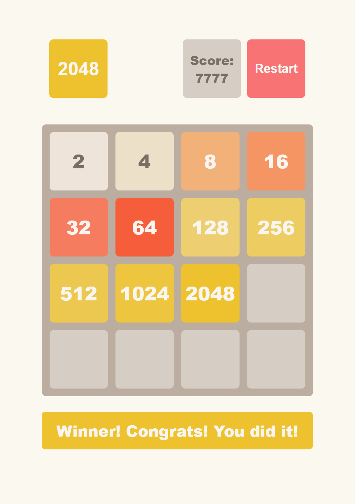

<div align="center">

# 2048

A clean, dependency-free implementation of the classic **2048** puzzle game,
built with vanilla JavaScript, SCSS and Parcel.

**[▶ Play the live demo](https://blabunch.github.io/2048/)**

[](https://github.com/blabunch/2048/actions/workflows/deploy.yml)




</div>

## About

Slide numbered tiles on a 4×4 grid. When two tiles with the same number touch,
they merge into one, and their sum is added to your score. Reach the **2048**
tile to win. If the board fills up and no merges are left, the game is over.

## Features

- **Keyboard controls:** arrow keys move the tiles.
- **Touch controls:** swipe on the board to play on a phone or tablet.
- **Score tracking:** every merge adds the new tile's value to the score.
- **Win and lose detection:** a message appears when you reach 2048 or run out of moves.
- **Start / Restart:** one button starts a new game or resets the current one.
- **Separate game logic:** the `Game` class doesn't touch the DOM, so you can test it on its own or reuse it.
- **Small bundle:** about 11 KB of JS and CSS, with no runtime dependencies.

## How to play

| Action          | Desktop        | Mobile             |
| --------------- | -------------- | ------------------ |
| Start the game  | Click **Start** | Tap **Start**      |
| Move tiles      | `←` `↑` `→` `↓` | Swipe on the board |
| Start over      | Click **Restart** | Tap **Restart**  |

## Tech stack

- **JavaScript (ES6+):** game logic and UI rendering
- **SCSS:** styles, with a modifier class for each tile value
- **Parcel 2:** bundling and the dev server
- **ESLint, Stylelint, LintHTML:** code quality checks
- **GitHub Actions + GitHub Pages:** CI and automatic deployment

## Getting started

Requirements: [Node.js](https://nodejs.org/) 20+ and npm.

```bash
git clone https://github.com/blabunch/2048.git
cd 2048
npm install
npm start
```

The dev server starts with hot reload, and the game opens in your browser.

## Scripts

| Command               | Description                                         |
| --------------------- | --------------------------------------------------- |
| `npm start`           | Start the dev server                                |
| `npm run lint`        | Run ESLint, Stylelint and LintHTML                  |
| `npm test`            | Run the linters and then the test suite             |
| `npm run build`       | Build the project into `dist/`                      |
| `npm run build:pages` | Make a production build with relative paths for GitHub Pages |

## Project structure

```
src/
├── index.html              # Page markup: header, 4×4 board, messages
├── images/
│   └── reference.png       # Screenshot
├── modules/
│   └── Game.class.js       # Game logic (state, moves, merges, win/lose)
├── scripts/
│   └── main.js             # UI: rendering, keyboard and swipe handling
└── styles/
    └── main.scss           # Styles and tile colors
```

### Game API

```js
const game = new Game(initialState?); // optional 4×4 number matrix

game.start();      // place two random tiles and begin
game.restart();    // reset the board and score
game.moveLeft();   // also moveRight(), moveUp(), moveDown()

game.getState();   // number[][]
game.getScore();   // number
game.getStatus();  // 'idle' | 'playing' | 'win' | 'lose'
```

## Deployment

Every push to `master` triggers the
[Deploy to GitHub Pages](.github/workflows/deploy.yml) workflow. It lints the
code, builds the production bundle and publishes it to GitHub Pages.

To turn it on once, go to **Settings → Pages → Build and deployment** and set
**Source** to **GitHub Actions**.

## License

Distributed under the [GPL-3.0 License](LICENSE).

---

<div align="center">

Made by [Bohdan Labunets](https://github.com/blabunch)

</div>
